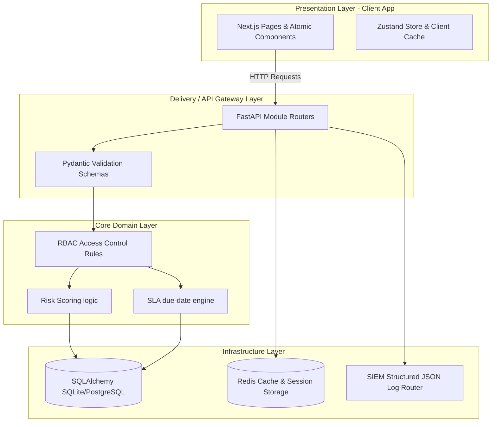

# GRC Sentinel - System Architectural Overview

This document provides a comprehensive technical overview of the SecureBank GRC Platform's system architecture, design patterns, security controls, and core integrations.

---

## 1. Clean Architecture Design Pattern

The application is structured following the **Clean Architecture / Hexagonal Architecture** pattern. This separates the business rules from frameworks, user interfaces, and database drivers, ensuring high testability and simple maintenance.

### Architectural Layers
- **Presentation Layer**: Next.js 14+ client-side application. Implements a responsive layout shell, Zustand storage for session authentication, and React Query caching.
- **Delivery / API Layer**: FastAPI routers that parse request payloads, validate inputs using Pydantic, apply rate limiting via SlowAPI, and serialize outbound JSON responses.
- **Domain Layer**: Clean Python business rules including risk score calculations ($Score = Likelihood \times Impact$), Corrective and Preventive Action (CAPA) SLA tracking, and audit trail record generation.
- **Infrastructure Layer**: Database persistence (SQLAlchemy models), local cache & rate-limit tracking (Redis), and event streaming for SIEM integration.

---

## 2. Core Security Hardening & Controls

GRC Sentinel implements strict security controls to protect compliance configurations, threat matrices, and user databases.

### A. Multi-User Tenant Isolation
Every database table in [models.py](file:///c:/Projects/Cyber%20Security%20projects/GRC_System/GRC/api/models.py) includes a `tenant_id` column.
- Database access dependencies dynamically resolve and inject the client's `tenant_id` derived from their verified JWT claim.
- All query operations (e.g., retrieving risks, logging incidents) are pre-filtered on `tenant_id`. This prevents cross-tenant access.

### B. Role-Based Access Control (RBAC)
Role definitions (**Viewer**, **GRC Analyst**, and **Administrator**) are enforced at the API level via decorators inside [dependencies.py](file:///c:/Projects/Cyber%20Security%20projects/GRC_System/GRC/api/dependencies.py).
- **Viewer**: Read-only access to compliance reports, metrics, and risk scores. State mutations (POST/PATCH/DELETE) are blocked.
- **GRC Analyst**: Can create, modify, or delete records in Risks, Controls, Incidents, and Audits.
- **Administrator**: Access to administrative modules, user role modification, and the raw system audit trail.

### C. Multi-Factor Authentication (MFA)
- The platform uses Time-Based One-Time Password (TOTP) MFA via the standard Google Authenticator specification (implemented in [auth.py](file:///c:/Projects/Cyber%20Security%20projects/GRC_System/GRC/api/routers/auth.py)).
- If MFA is active for a tenant, the initial password check grants a temporary token requiring a second verification call with a valid 6-digit passcode.
- Backup recovery codes are provided during setup and stored in the database using strong hashes (bcrypt).

### D. Structured Audit Logging for SIEM
All sensitive security, identity, and compliance modification actions are captured in real-time by [audit_logging.py](file:///c:/Projects/Cyber%20Security%20projects/GRC_System/GRC/api/audit_logging.py).
- Events (such as `USER_LOGIN`, `MFA_ENABLED`, `RISK_DELETED`) are generated as structured JSON payloads.
- Payloads include user context, transaction ID, client IP, action, timestamp, and details of modified entities, suitable for immediate routing to SIEM systems.

---

## 3. Payment Gateway Webhook Architecture

The platform supports dual integrations for payment processing, validating incoming events cryptographically at the gateway:

- **Stripe Integration**: Verifies webhooks inside [payments.py](file:///c:/Projects/Cyber%20Security%20projects/GRC_System/GRC/api/routers/payments.py) using Stripe's native HMAC-SHA256 signature scheme against `STRIPE_WEBHOOK_SECRET`.
- **Flutterwave Integration**: Validates incoming events using a custom `verif-hash` header verified against a local secret hash to guarantee that events originate strictly from Flutterwave servers.
