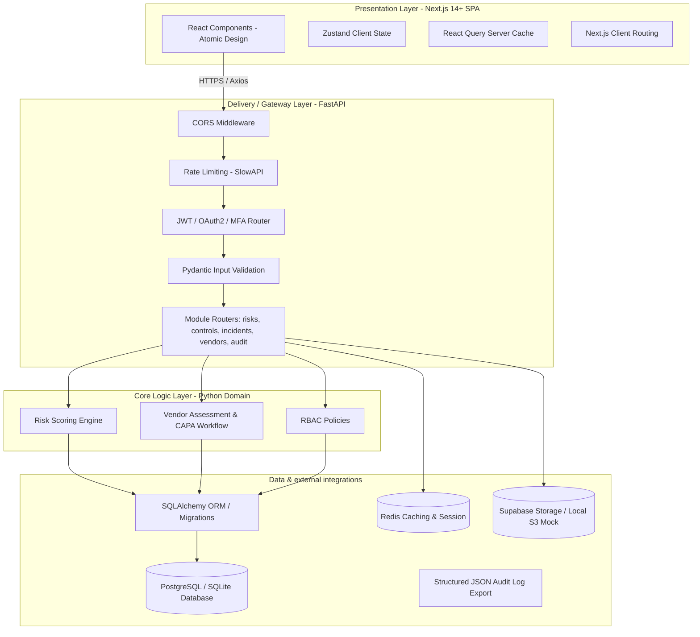
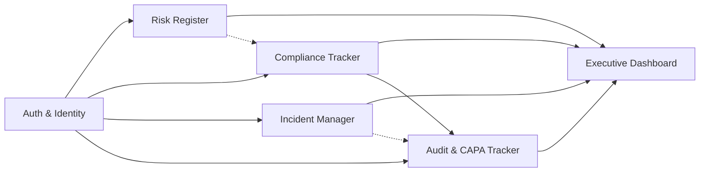
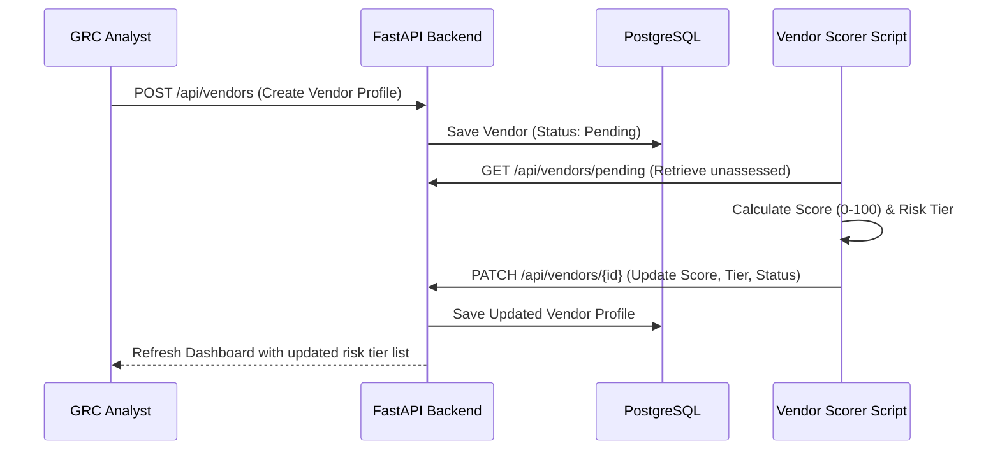
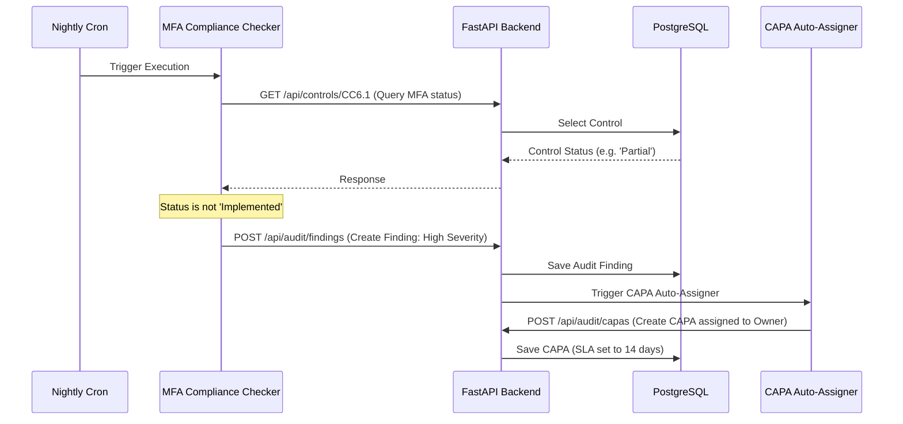

# Master Analysis Document: SecureBank GRC Platform

This document consolidates the system architecture, security controls, data flows, modules, third-party integrations, stack decisions, and implementation plan for the **SecureBank Governance, Risk & Compliance (GRC) Platform**.

---

## 1. System Architecture Overview

The SecureBank GRC Platform is designed using a **Clean Architecture / Hexagonal Architecture** pattern, decoupling the core domain logic from framework, delivery, and database details. The backend is implemented in **FastAPI (Python)**, and the frontend is in **React / Next.js 14+ (App Router)**.

### Architecture Layer Diagram

---

## 2. Identified Modules & Interdependencies

The platform is structured into five core GRC modules, plus infrastructure modules:

1. **Authentication & Identity Module**: Handles authentication, TOTP MFA, session state, JWT tokens, and role definitions.
2. **Risk Register Module**: Handles risk identification, assessment (likelihood/impact), automated risk scoring ($Score = Likelihood \times Impact$), and mitigation tracking.
3. **Compliance Tracker Module**: Maps standards (SOC 2, ISO 27001, PCI-DSS) to controls, tracks control status (Implemented, Partial, In Progress, Not Started), and handles evidence upload.
4. **Incident Manager Module**: Logs incidents, calculates MTTD (Mean Time to Detect) and MTTR (Mean Time to Resolve), tracks incident lifecycle stages, and links to relevant risks or controls.
5. **Audit Log & CAPA Tracker**: Provides immutable audit logs and tracks Corrective and Preventive Actions (CAPA) with automated SLA reminders based on severity.
6. **Executive Dashboard**: Aggregates metrics from all modules, calculates risk profile metrics, compliance coverage percentages, incident resolution trends, and generates reports.

### Module Dependency Map

---

## 3. Data Flow Maps

All data flows are secured via HTTPS, input validation at boundaries, and tenant scoping.

### A. Vendor Assessment & Scoring Flow

### B. Continuous Compliance & CAPA Flow

---

## 4. Security Control Inventory (Mapped to Layers)

| # | Security Control | Target Layer | Verification Method |
|---|---|---|---|
| 1 | **Strict CORS Configuration** | Network / API | Verify requests from origins other than `myapp.com` or configured DEV origins are rejected with a 400/403. |
| 2 | **Redirect URL Validation** | Identity / API | Verify `redirect_uri` in OAuth/Login flows is restricted to an exact allow-list. |
| 3 | **Supabase Storage RLS Policies** | Data / Storage | Verify that users can only write/read files with paths matching `auth.uid() = owner` unless they are an admin. |
| 4 | **No-Console rule & Structured Logging** | Application | ESLint rules for `no-console`, Winston/Pino/Winston-equivalent Python JSON logger in production. |
| 5 | **Webhook Signature Verification** | API Gateway | Verify incoming webhooks (e.g., Stripe) carry valid HMAC signatures and reject mismatches. |
| 6 | **Server-Side Role Authorisation (RBAC)**| Application | API decorators verify `user.role == 'admin'` on server-side before executing state mutation. |
| 7 | **Dependency Auditing** | CI/CD | Run `npm audit` and `safety check` in CI pipeline. |
| 8 | **Password Reset Rate Limiting** | Identity / API | SlowAPI rule `3/hour` per email/IP, returning generic anti-enumeration response. |
| 9 | **Generic Error Messages & Handlers** | API Gateway | Global exception handler catches database/system errors and returns a sanitized JSON 500 error message. |
| 10 | **JWT Rotation & Refresh Token Rotation** | Identity | Access tokens expire in 7 days; refresh tokens are stored hashed (bcrypt) and rotated on every single use. |
| 11 | **Public Endpoint Rate Limiting** | Network / API | SlowAPI limits: 100 req/min for public reads, 60 req/min for auth actions, 10 req/min for login. |
| 12 | **Input Validation & Sanitization** | API Gateway | Pydantic schemas with `extra = 'forbid'`, input HTML escaping via `html.escape`. |
| 13 | **Secure Key Handling** | Infrastructure | System secrets loaded purely via environment, no prefix leak in frontend (Vite prefix rules). |
| 14 | **DDoS Protection & Body Limits** | Network / Infrastructure | Middleware rejects request payloads > 1MB; connection pool capped to 100 connections. |
| 15 | **Multi-User Tenant Isolation** | Data Layer | Every table has `tenant_id` column; all DB queries must be parameterized and filtered by tenant. |

---

## 5. Third-Party Integrations Required

1. **Supabase Auth & Storage**: Used for federated/email-password auth and secure document storage for compliance evidence.
2. **Stripe API (Webhooks)**: For simulating secure incoming payment webhooks and demonstrating cryptographic signature validation.
3. **Cloudflare WAF / CDN**: (Simulated in local configurations/Compose or documented in Runbooks) for external DDoS and edge rate limiting.

---

## 6. Identified Risks, Ambiguities, and Mitigations

1. **Supabase RLS vs Local PostgreSQL Development**:
   - *Risk*: Implementing Supabase-specific SQL policies locally on a pure PostgreSQL database might require specific setup.
   - *Mitigation*: We will write SQL migration scripts that initialize the `storage` schema and mock the `auth.uid()` function in local PostgreSQL so that RLS rules function identically in local Docker Compose.
2. **TOTP MFA Setup**:
   - *Risk*: Generating QR codes and verifying TOTP tokens requires standard Python cryptography libraries (`pyotp`).
   - *Mitigation*: Integrate `pyotp` in the FastAPI authentication router and provide backup recovery codes stored hashed in the database.
3. **Real-Time Notification / Background Jobs**:
   - *Risk*: Celery requires a separate broker (Redis).
   - *Mitigation*: Utilize FastAPI's built-in `BackgroundTasks` for lightweight asynchronous tasks, or spin up Redis and a simple worker script inside Docker Compose if high throughput is needed. We will use Redis for rate-limiting and session storage anyway, so a lightweight task framework fits cleanly.

---

## 7. Technology Stack Decision & Justification

- **Frontend**: Next.js 14 (App Router) + TypeScript + Tailwind CSS.
  - *Justification*: Server-side rendering (SSR) capabilities for dashboards, high-performance App Router routing, native TypeScript type safety, and fast compilation.
- **Backend**: Python 3.11 + FastAPI + SQLAlchemy 2.0.
  - *Justification*: Superb type validation using Pydantic, auto-generated OpenAPI documentation, and high performance due to asynchronous event loop.
- **Database**: PostgreSQL 16 (for robust relational mappings, JSONB support for assessments, and support for RLS).
- **Cache / Store**: Redis (for session management, API rate limiting via SlowAPI, and background job queueing).
- **ORM**: SQLAlchemy + Alembic for Python database migrations.

---

## 8. Verification Strategy

- **Automated Tests**: Pytest for the FastAPI backend, Vitest / Testing Library for the React frontend.
- **Security Scans**: `bandit` for Python AST security scanning, `safety` for dependency audits, `snyk` / `trivy` in Docker container scans.
- **Manual Checklist**: Confirming tenant boundaries (trying to query another tenant's data yields 403/404), checking headers (HSTS, CSP, X-Frame-Options), verifying rate limits.
