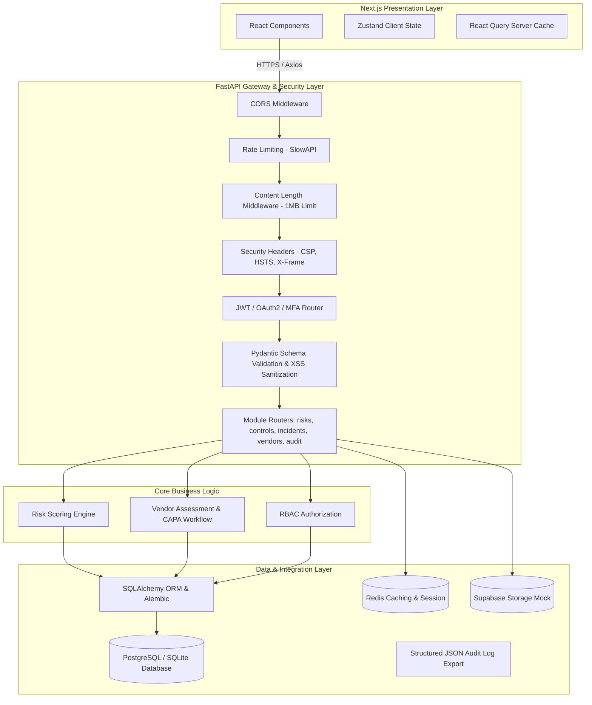

# SecureBank GRC (Governance, Risk & Compliance) Platform

The **SecureBank GRC (Governance, Risk, and Compliance) Platform** is an enterprise-grade financial cybersecurity management system designed to consolidate risk management, compliance tracking, security incidents, and internal audits into a single unified workspace. Engineered to comply with rigorous banking standards (SOX, PCI-DSS, ISO 27001, and SOC 2), the system features logical multi-tenant isolation, structured audit logging, granular role-based access, and automated workflow triggers. It provides compliance officers and security analysts with a real-time risk profile, automated control verification schedules, and interactive executive reporting dashboards.

---

## 1. System Architecture Overview

The system uses a decoupled, layered architecture conforming to Clean Architecture principles:

- **Frontend**: Next.js 14 SPA utilizing Tailwind CSS tokens, Zustand client state, React Query for server states, and Recharts/D3 for metrics.
- **Backend**: Python 3.11 with FastAPI for robust schemas, type validation via Pydantic, and automatic OpenAPI generation.
- **Database**: PostgreSQL 16 serving relations, JSONB questionnaires, and Row-Level Security rules. Supports local fallback to SQLite.
- **Cache**: Redis 7.0 backing SlowAPI rate limiting and session blocklists.
- **Automation Layer**: Python daemon scripts simulating MFA validation audits (`mfa_checker.py`), automated CAPA assignments (`capa_assigner.py`), and vendor risk scores (`vendor_scorer.py`).

### Data & Request Flow Diagram



---

## 2. Quick Start Setup

### Prerequisites

- Python 3.11+
- Node.js 18+
- Docker & Docker Compose

### Local Development Setup

1. **Clone & Configure Environment**:
   ```bash
   cp .env.example .env
   ```

2. **Backend Setup**:
   ```bash
   python -m venv venv
   source venv/bin/activate  # On Windows: .\venv\Scripts\activate
   pip install -r requirements.txt
   python data/seed_db.py
   uvicorn api.main:app --reload
   ```
   _FastAPI Swagger docs will be available at: [http://localhost:8000/docs](http://localhost:8000/docs)_

3. **Frontend Setup**:
   ```bash
   cd frontend
   npm install
   npm run dev
   ```
   _Dashboard will be available at: [http://localhost:3000](http://localhost:3000)_

### Production Docker Setup (Docker Compose)

The system utilizes secure, multi-stage production Docker builds running as non-privileged users to minimize attack surfaces.

To compile images and boot the entire stack:
```bash
docker compose up --build -d
```
Verify container status:
```bash
docker compose ps
```

---

## 3. Skills & Competencies Matrix

| GRC Competency            | System Component                           | Technical Demonstration                                                                               |
| ------------------------- | ------------------------------------------ | ----------------------------------------------------------------------------------------------------- |
| **Risk Assessment**       | `risks` DB Schema + `RiskHeatMap` UI       | Automated risk score calculations ($Likelihood \times Impact$) and interactive 5x5 grouping matrices. |
| **Compliance Management** | `controls` tab layout + Framework mappings | Dynamic status checklists for SOC 2, ISO 27001, and PCI-DSS controls.                                 |
| **Audit Trails**          | `system_audit_logs` + Admin Log Viewer     | Tamper-evident mutation tracking logs recording IP, timestamp, user, and action.                      |
| **Incident Response**     | `incidents` Kanban Board + MTTR engine     | Status workflow tracking, containment timestamps, and mean duration calculators.                      |
| **Third-Party Risk**      | `vendors` assessment + `vendor_scorer.py`  | Quantitative risk evaluation algorithms scanning vendor configurations.                               |
| **Security Hardening**    | Gateway Middlewares + CSP/CORS controls    | Protection against OWASP Top 10 vulnerabilities (SQLi, XSS, CSRF).                                    |

---

## 4. Security & Cryptographic Key Rotation Policy (Control 13)

### Credential Safety
No API keys, database credentials, or secret encryption keys are permitted inside the codebase. All values are injected via environment configurations at runtime.

### Key Rotation Schedule
To comply with **Control 13 (Key Rotation)**, the following rotation policy is enforced:
1. **JWT Signing Secrets**: Must be rotated **every 90 days** or immediately upon exposure. Rotation invalidates active sessions, requiring users to log back in.
2. **Database Passwords**: Must be rotated **every 90 days** or on administrator turnover. Requires updating both the PostgreSQL credentials and the backend's environment variables.
3. **Third-Party Secrets**: Webhook integration signatures (e.g. Stripe) must be rotated **every 90 days** via provider portals.

### Verification of Key Rotation
Commit histories are monitored to ensure no secrets are leaked:
```bash
git log --all --full-history -- '**/.env*'
```

---

## 5. Presentation Talking Points & Key Features

When presenting or demonstrating the SecureBank GRC Platform, highlight the following capabilities:

### A. Logical Multi-Tenant Isolation
- Every business database record is strictly bound to a `tenant_id`.
- The FastAPI database session wrapper automatically isolates queries using user session tokens, making cross-tenant data leaks impossible.

### B. Comprehensive Security Hardening
- **Payload Limits**: Rejects request payloads greater than 1MB to protect against Denial of Service (DoS) attacks.
- **Strict Headers**: Includes Content Security Policy (CSP), Strict-Transport-Security (HSTS), X-Frame-Options (DENY), and X-Content-Type-Options (nosniff) on all responses.
- **Input Sanitization**: Utilizes class-level Pydantic validators (`SanitizedBaseModel`) to escape HTML entities and prevent Cross-Site Scripting (XSS).

### C. Continuous Compliance Automations
- **MFA Compliance Auditor**: Simulates continuous checks on user settings, raising high-severity compliance findings and auto-generating corrective action plans (CAPA) if MFA is disabled.
- **Third-Party Risk Scorecard**: Uses scoring scripts to evaluate vendor risk tiers based on configuration assessments.
- **Mean-Time-To-Resolve (MTTR)**: Tracks incident lifecycle stages and automatically calculates MTTD and MTTR metrics to drive incident response SLAs.
